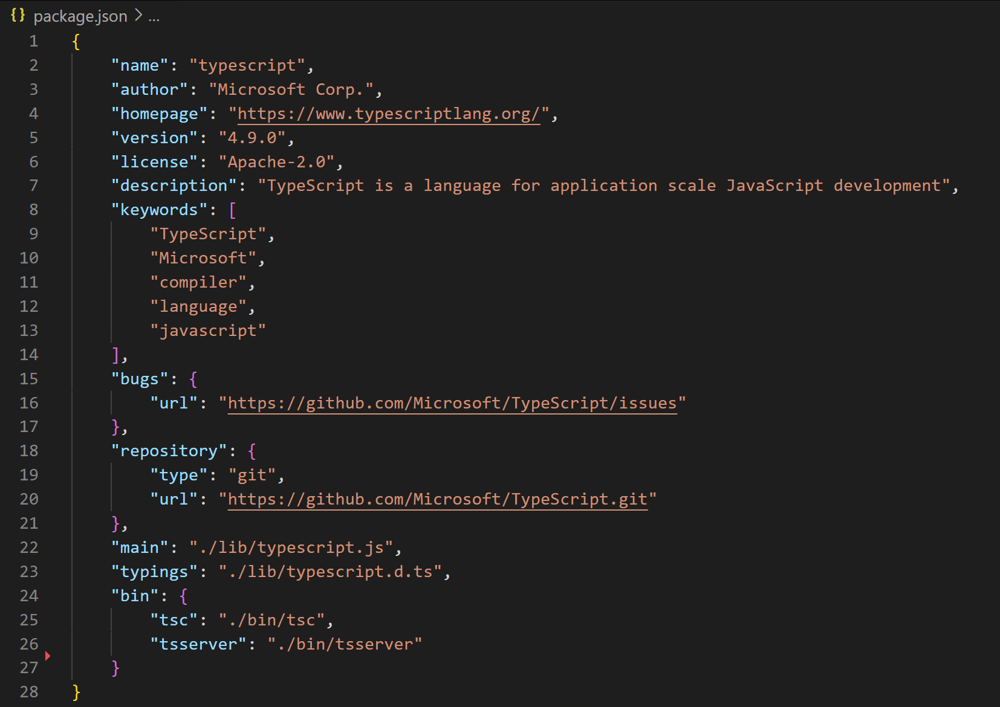
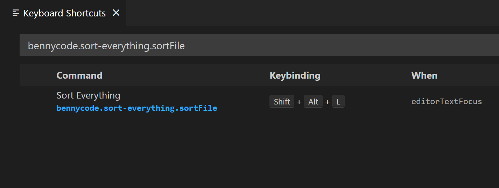

# Sort Everything

This VS Code extension sorts JSON, YAML, and plain text files. It can sort the selected lines of code or the entire file (if no lines are selected).

## Installation

Open the [extensions' marketplace site][1] and click "Install".

Alternative:

1. Start Visual Studio Code
2. Press <kbd>Ctrl</kbd> + <kbd>Shift</kbd> + <kbd>X</kbd> to [browse for extensions](https://code.visualstudio.com/docs/editor/extension-marketplace#_browse-for-extensions)
3. Search for `bennycode.sort-everything.sortFile`
4. Select the "Sort Everything" extension and click on "Install"

## Usage

By default, sorting is applied when using the shortcut <kbd>Alt</kbd> + <kbd>Shift</kbd> + <kbd>L</kbd>. 

You can change the keybinding in your [Keyboard Shortcuts editor](https://code.visualstudio.com/docs/getstarted/keybindings#_keyboard-shortcuts-editor):

The Command ID is `bennycode.sort-everything.sortFile`.

## Features

- Sort plain text file
- Sort plain text selection
- Sort JSON file
- Sort JSON selection
- Sort YAML file
- Sort YAML selection

[1]: https://marketplace.visualstudio.com/items?itemName=bennycode.sort-everything
